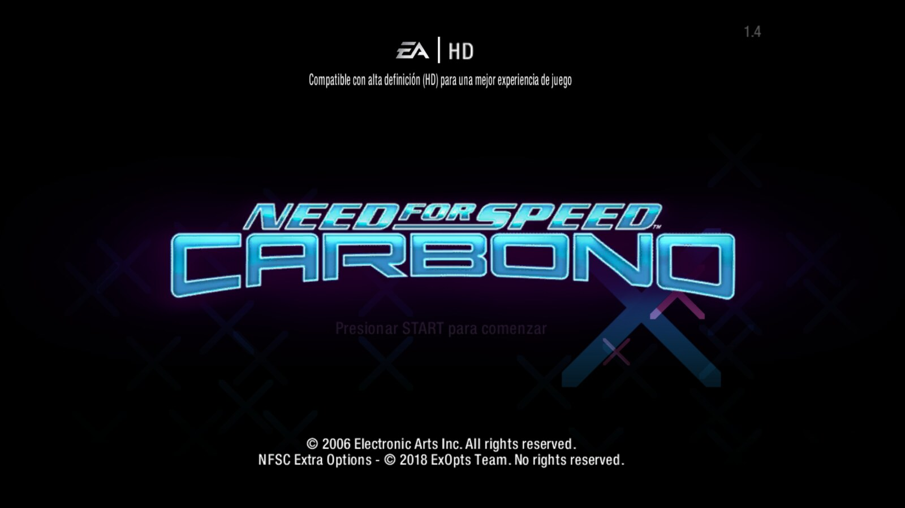
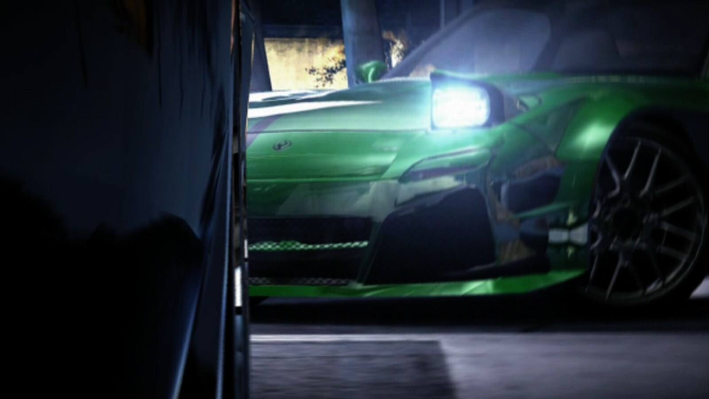

# Need For Speed: Carbon (2006) en Linux

Instalación completa en un comando, sobre Wine, **en español**, a 1920x1080 real,
con la calidad gráfica en el punto donde la GPU trabaja al máximo sin perder fluidez,
y sin SafeDisc.



Probado en **Kubuntu 26.04** (Plasma 6 sobre Wayland, kernel 7.0) con **Wine 11.0 estable**
del repositorio oficial de WineHQ, y una GPU integrada **Intel Iris Xe** en un i5-1235U.

```bash
git clone https://github.com/andresgarcia0313/nfs10-carbon-wine-linux.git
cd nfs10-carbon-wine-linux
./instalar.sh
```

Descarga unos 3,9 GB, ocupa 6,7 GB instalado y tarda entre diez y veinte minutos.

## Rendimiento medido

Treinta segundos con MangoHud, con la configuración que deja el instalador:

| | valor |
|---|---|
| Mediana | **132,5 fps** |
| Media | 126,5 fps |
| 1 % peor | **85,1 fps** |
| Carga de GPU | 92 % de media, pico 98 % |
| Carga de CPU | 42 % |

La GPU al 92 % es el dato que importa: significa que la calidad está subida hasta donde
el hardware da, y aun así el peor 1 % no baja de 85 fotogramas. Subir el suavizado de
bordes por encima de ahí solo quitaría fluidez sin ganar nada apreciable.

---

## De dónde sale el juego

Un solo disco, a diferencia de Most Wanted: esta edición trae dieciséis idiomas de texto.

| Qué | Enlace |
|---|---|
| DVD original 1:1, parche 1.4, ejecutable sin CD y claves | [archive.org/details/need-for-speed-carbon_202510](https://archive.org/details/need-for-speed-carbon_202510) |
| Widescreen Fix | [ThirteenAG/WidescreenFixesPack](https://github.com/ThirteenAG/WidescreenFixesPack/releases/tag/nfsc) |
| NFSC Extra Options | [ExOptsTeam/NFSCExOpts](https://github.com/ExOptsTeam/NFSCExOpts) |

Este repositorio **no distribuye el juego**: solo automatiza la instalación desde esos enlaces.

---

## El español: qué queda y qué no

Conviene ser exacto, porque no es todo o nada.

| Parte | Idioma |
|---|---|
| Menús, HUD, textos del juego | **Español** |
| Título del juego | **Carbono** (así se llamó aquí) |
| Subtítulos de las cinemáticas | **Español**, y hay que activarlos |
| Audio de las cinemáticas | Inglés |

El disco trae dieciséis ficheros de idioma, entre ellos `Spanish_Global.bin` y
`Mexican_Global.bin`, pero sus vídeos son la tanda nórdica: checo, danés, holandés,
inglés, finés, húngaro, polaco y sueco. **No existe doblaje al español en las ediciones
de PC de Carbon.** Lo que sí hay es un sistema de subtítulos propio: los ficheros
`SUBTITLES/*.sub` guardan solo los tiempos, y el texto sale del fichero de idioma. Con el
juego en español, los subtítulos salen en español.

El detalle es que **vienen apagados de fábrica**: `ShowSubs = 0` en Extra Options. El
instalador lo pone a 1.

---

## Los defectos reales, y qué los causa

### 1. El juego no arranca: SafeDisc

El `nfsc.exe` del disco lleva SafeDisc, reconocible por dos secciones PE llamadas
`stxt774` y `stxt371`. Wine no implementa el controlador `secdrv` que necesita.

Y **el parche oficial 1.4 no la quita**: se aplica, deja el ejecutable en 8.950.976 bytes,
y las secciones siguen ahí. Hace falta el ejecutable limpio de 7.217.152 bytes.

### 2. El parche 1.4 renombra el ejecutable

Pequeño pero desconcierta: el disco trae `nfsc.exe` y después del parche el fichero se
llama `NFSC.exe`. En Linux eso son dos nombres distintos y cualquier guion que busque el
primero deja de encontrarlo. Todos los guiones de aquí lo buscan sin distinguir mayúsculas.

### 3. El juego busca cuatro ramas de registro, dos con nombre en español

`strings NFSC.exe` revela algo que ninguna guía menciona:

```
Software\Electronic Arts\Need for Speed Carbon
Software\Electronic Arts\Need for Speed Carbono
Software\Electronic Arts\Electronic Arts\Need for Speed Carbon\ergc
Software\Electronic Arts\Electronic Arts\Need for Speed Carbono\ergc
```

**"Carbono" es el título en español**, y es la rama que el juego usa cuando el idioma es
el nuestro. Crear solo la inglesa lo deja sin encontrar sus propios ajustes. El instalador
crea las cuatro, y sus equivalentes bajo `Wow6432Node`.

### 4. La calidad gráfica arranca al mínimo

Igual que en Most Wanted: la autodetección de hardware compara contra una tabla de 2006 y,
al no reconocer la GPU, cae al perfil más bajo. En Carbon el síntoma más visible es
`g_ShadowDetail=0`, es decir **sin sombras**.

La solución no es pelearse con el registro sino `WriteSettingsToFile = 1` en el parche
panorámico: vuelca todos los ajustes a un fichero de texto plano dentro de la carpeta del
juego, donde editarlos es trivial. El instalador sube el detalle de coches, las sombras y
los reflejos del asfalto, y deja el suavizado de bordes donde estaba, que es lo que más
penaliza en una GPU integrada.

### 5. El cargador de complementos daba pantalla negra bajo Wine

Está reportado en las incidencias [#525](https://github.com/ThirteenAG/WidescreenFixesPack/issues/525),
[#1013](https://github.com/ThirteenAG/WidescreenFixesPack/issues/1013) y
[#1794](https://github.com/ThirteenAG/WidescreenFixesPack/issues/1794) del Widescreen Fix:
el juego se cerraba nada más ponerse la pantalla en negro. La última de ellas es de abril
de 2026 y el autor responde que la versión más reciente lo resuelve.

**Confirmado aquí**: con la versión del 4 de mayo de 2026 el juego arranca a la primera.
Por eso el instalador siempre baja la última publicación, nunca una fija.

### 6. Wayland y pantalla completa

KDE tiene fallos conocidos con el cursor atrapado en juegos a pantalla completa bajo Wine
([bug 511075](https://bugs.kde.org/show_bug.cgi?id=511075)). Se evita con
`WindowedMode = 4`, pantalla completa sin bordes. Medido: la ventana sale de 1920x1080
exactos en la posición 0,0, sin reglas de KWin.

PCGamingWiki además atribuye a ese mismo modo el arreglo del tartamudeo de una vez por
segundo y del tope de 60 fotogramas.

### 7. Cierres del juego que no son de Wine

Dos de fábrica, y los dos ya arreglados por los complementos que instala:

- **Cierre al cargar un perfil guardado**: `CrashFix = 1`, activo por defecto en el parche.
- **Fallos varios de progreso y del modo carrera**: `CrashFix = 1` en Extra Options.


---

## Cómo se instala: por paquetes, sin el instalador de EA

El DVD guarda el juego en `0compressed.zip` y `1compressed.zip`, que son ZIP estándar.
Extraerlos deja lo mismo que dejaría el instalador, sin depender de que su interfaz
funcione bajo Wine.

Un apunte para quien quiera inspeccionar el disco: **el ISO es UDF, no ISO9660**, así que
el sector 16 está vacío y las herramientas que buscan ahí la firma `CD001` no encuentran
nada. `7z` lo abre igual, pero expone los nombres en minúsculas.

## Qué queda instalado

```
Need For Speed X Carbon/
├── jugar.sh                     lanzador
├── juego/                       el juego (6,3 GB)
│   ├── NFSC.exe                 7.217.152 bytes, sin SafeDisc
│   ├── dinput8.dll              cargador de complementos (uno solo)
│   ├── scripts/                 los dos .asi y sus .ini
│   ├── MOVIES/                  61 vídeos
│   ├── SUBTITLES/               66 ficheros de tiempos
│   ├── LANGUAGES/               18 ficheros, con Spanish_Global.bin
│   ├── CARS/                    los coches
│   └── save/NFS Carbon/         partidas y Settings.ini
├── prefix/                      prefijo de Wine propio
└── respaldos/                   ejecutables originales
```

## Opciones del lanzador

| Opción | Qué hace |
|---|---|
| `--sinintro` | Salta los vídeos de arranque. Restaura la configuración al salir |
| `--ventana` | Modo ventana con borde |
| `--fps` | Contador de rendimiento con MangoHud |
| `--sinsync` | Oculta `/dev/ntsync` y fuerza la sincronización antigua de Wine |
| `--registro` | Traza de ficheros de Wine en `traza-wine.log` |

El lanzador saca además el juego a su propio ámbito de systemd. Sin eso, arrancarlo desde
una sesión que esté confinada a los núcleos lentos se lo transmite al juego.

## Comprobar que quedó bien

```bash
./instalar.sh --comprobar
```

Verifica el ejecutable y la ausencia de SafeDisc leyendo las secciones PE, que haya un solo
cargador, los complementos, el idioma en las **cuatro** ramas del registro más los dos
ficheros de configuración, el override de `dinput8`, y que los subtítulos estén activados.



## Licencia

Los guiones de este repositorio son de dominio público. El juego, su imagen de disco y los
complementos pertenecen a sus autores y no se distribuyen aquí.
